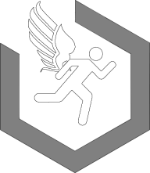

    

<h1 align="center">
AFFMS 
Air Force Fitness Mock System
</h1>

---

## About

A webapp for managing PT tests for individuals and groups of people.

## Built with

* [NodeJS](https://nodejs.org/)
* [React](https://reactjs.org/)
* [Material-UI](https://material-ui.com/)
* [ChartJS](https://www.chartjs.org/)

## Authors

* **Brandon Swenson**- *Initial work* - [bmswens](https://github.com/bmswens)

## License

This project is licensed under the MIT License - see the [LICENSE.txt](LICENSE.txt) file for details